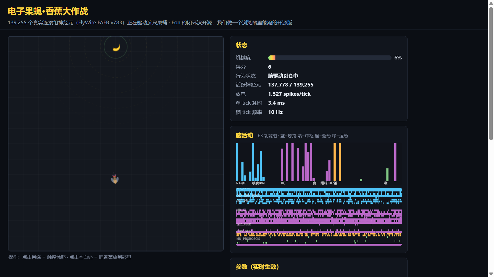
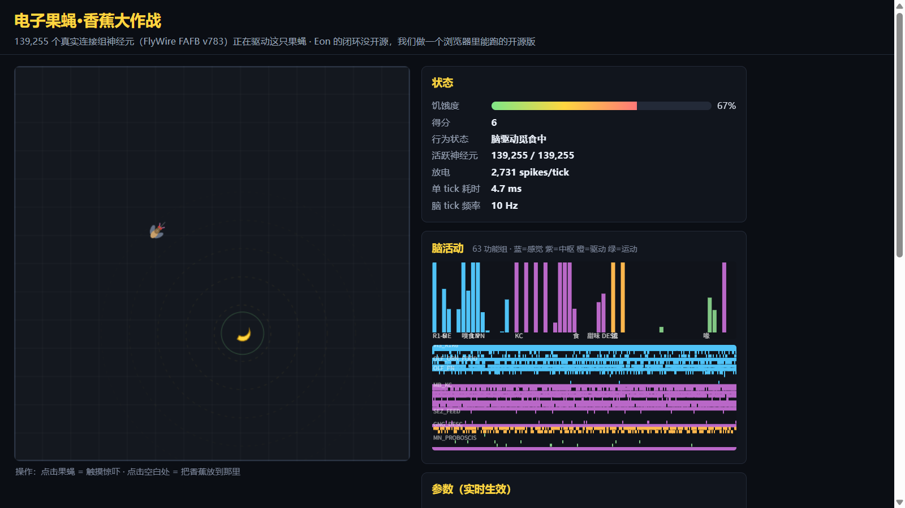
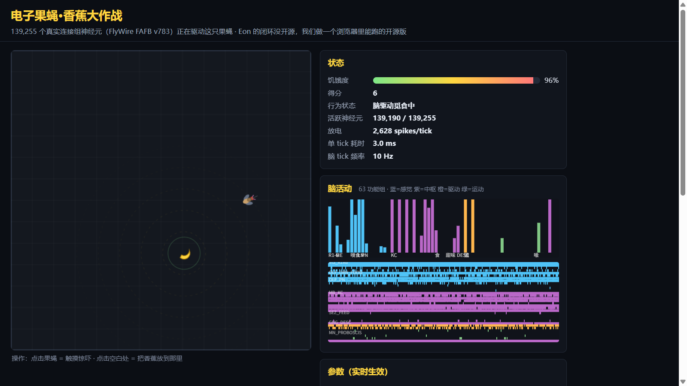

# "我们上传了一只果蝇"之后，我用 13.9 万个真实神经元在浏览器里养了一只

## 43 秒的视频，和没开源的那部分

2026 年 3 月 7 日，Eon Systems 联合创始人 Alex Wissner-Gross 在 Substack 上发出一段 43 秒的视频：画面左边，一只虚拟果蝇在沙盒里爬行、转向、找到香蕉片、停下来梳理自己；右边是一张同步闪烁的"全脑仿真"神经元活动图。博文宣称，这是"世界首个产生多种行为的全脑仿真具身化"。第二天，CEO Michael Andregg 在 X 上把话说满："We've uploaded a fruit fly."——我们上传了一只果蝇。

接下来是熟悉的剧本：马斯克等人转发助推，3 月 9 日起中文媒体集中跟进，"数字永生""意识上传"轮番登上标题。

科学界的反应则迅速从"哇"切换到"等等"。3 月 16 日，The Verge 和 The Register 同日刊发带专家质疑的深度报道；3 月 19 日，LessWrong 长文《No, we haven't uploaded a fly yet》（不，我们还没有上传一只果蝇）指出：演示里精细的行走与梳理主要由身体里预训练的控制器完成，连接组只发出"前进/左转"级别的高层指令——用一段规则脚本替换整个大脑，视频看起来会一模一样。全脑仿真领域元老 Randal Koene 后来把这叫"木偶效应"：观众看到的，是身体代码在纠正脑模型的错误。而真实果蝇的运动中枢腹神经索（VNC），根本不在仿真里。

对工程师来说最要命的一点则是：Eon 开源了脑模型本身，但**让那段视频跑起来的具身闭环集成代码，没有公开**。你可以看视频，但无法检查视频是怎么产生的。

## 那我们做一个开源的：浏览器里的 13.9 万个神经元

我们的回应是《电子果蝇·香蕉大作战》（Banana Quest）：一个纯浏览器小游戏，用**真实的果蝇全脑连接组**驱动一只 2D 果蝇找香蕉。

"真实"具体指：神经元接线图来自 FlyWire FAFB v783——成年雌性果蝇的全脑连接组，139,255 个神经元、2,698,236 条聚合突触连接，权重来自真实突触计数，兴奋/抑制符号来自神经递质预测。这份数据打包成 12.4 MB 的二进制，浏览器加载后在 Web Worker 里以 10 Hz 跑一个 LIF（泄漏积分发放）脉冲网络。零依赖、零构建，打开网页，就是一只活的（赛博）果蝇。

闭环是这样的：香蕉气味按果蝇朝向拆成左右两路，作为电流注入左右触角的嗅觉受体神经元；脉冲沿真实接线传播——触角神经叶、蘑菇体、侧角——一路传到下行神经元；左右下行池的放电率差驱动转向，总放电率乘以饥饿度决定速度。爬到香蕉边上还不算完：只有脑内进食中枢加喙肌运动神经元池在两秒内放电超过阈值，香蕉才会被吃掉。**脑不点头，就吃不到。**

整个游戏没有手工行为层。每一次转向、停顿、下口，都是脉冲真的穿过这 13.9 万个神经元之后才发生的。

真正难的部分不是让网络"跑起来"，而是让信号传得过去。下面三个坑，每个都花了我们实打实的时间，也每个都能用一条命令复现。

## 坑一：把全脑的权重压到阈值的 1/2000，是什么体验

参考实现（社区项目 snedea/flybrain）用的是全局 max 归一化：所有权重除以全网最大权重，再乘 0.15。听起来合理，跑起来一片死寂。

我们做了一次全量扫描：这份连接组的突触计数是极端重尾分布——最大单条连接有 2405 个突触，中位数只有 8。用 2405 给所有人定标，中位权重就被压到 0.15 × 8 / 2405 ≈ 5×10⁻⁴，**大约是发放阈值的 1/2000**。

后果可以量化：用持续电流驱动 926 个嗅觉受体神经元，50 个 tick 里它们放出 9,262 个脉冲——全部死在感觉层，**中枢脑区放电：零**。触角神经叶下游的最强膜电压从 0.299 一路爬到 0.688，然后停在阈值 1.0 下面，不动了。果蝇"闻得到"香蕉，但闻到这件事永远传不进脑子。

修法是换成 Shiu et al. 2024 论文的思路：不看全局长什么样，按每个突触后神经元自己的总输入归一化。扫一遍参数，窗口窄得惊人：

- targetInput = 1.0：信号传到蘑菇体就没了；
- = 2.0：蘑菇体、侧角都活了，但下行神经元 200 tick 只放了 10 个脉冲；
- = 3.0：全链路打通，500 tick 满负荷输入也不过载；
- = 4.0：全脑"癫痫"——视觉髓质在零视觉输入下每 100 tick 狂放 11 万个脉冲。

从"全链路打通"到"全脑癫痫"，参数只差一格。这就是在聚合连接组上跑动力学的真实水位：**网络沉默不是刺激给错了，而是默认结局。**

## 坑二："果蝇的右脑总是更兴奋"

信号通了，下一个问题在出口。我们把 3,581 个下行神经元按胞体 x 坐标中位数切成左右两池（1,791 对 1,790），用放电率差做转向，然后测到一个让人挠头的东西：

- 只刺激左触角：左池 1,704 次放电，右池 2,106 次；
- 只刺激右触角：左池 1,633 次，右池 2,133 次。

**不管刺激哪一边，右池都更兴奋**，结构性偏置约 +24%；而真正携带方向信息的左右差异，只有约 1.3%。直接拿原始放电率转向，效果就是果蝇永远向右拐——香蕉在哪，不重要。

解法是基线校正：不看原始放电率，看每个池子相对自身慢速 EMA 基线的偏差。慢基线把静态偏置"高通"滤掉，残差追踪当前梯度。有意思的是，基线也不是越长越好：时间常数拉到 40 秒时，错误方向的偏差会被长期记忆"锁死"，扫参里 8 个配置有 7 个吃到率掉到 40–80%，路径曲折度飙到 17–23；τ = 5 秒反而保护了环路对当下梯度的响应。

这个偏置大概率是真实结构，而不是我们的 bug：果蝇嗅觉通路本身是双侧投射，x 坐标切半在解剖上很天真；而且 Schlegel 等人 2024 年证明，FlyWire 与 hemibrain 两个连接组之间超过一半的连接不互相复现——单一个体的侧向平衡，本来就不该信到几个百分点以内。

## 坑三：扫参扫出个假冠军

转向信号本就微弱，"多久吃到第一根香蕉"是个高方差指标：同样的参数，换个随机种子，成绩在 12 到 166 秒之间飘。我们做了两轮网格扫参：12 个配置 × 5 个种子 × 180 仿真秒。冠军配置闪亮登场——转向增益 1.8，5 个种子 100% 吃到，首吃中位 26.4 秒，平均得分 3.00，各项指标全面碾压默认值。

然后我们拿 10 个全新种子复核，冠军当场现形：8/10 吃到，中位 57.7 秒，平均得分 1.30——**比原默认还差**。所谓冠军，只是那 5 个种子的运气。

教训值得单独加粗：**小种子扫参估计的不是参数效应，是种子集本身。**

那最后是怎么变灵敏的？答案有点扫兴：不是把脑调聪明，而是把关卡调简单。所有"感觉→脑→读出"的映射一字未动，只改了一个关卡参数——香蕉刷新位置限制在 150–250 像素的环带内。首吃中位从 49.6 秒降到 27.3 秒，10/10 吃到，路径依然是明显的漫游搜索（曲折度 8.47，直线冲刺约为 1）。"脑决定往哪走"这条保真度主张，没有注一滴水。

顺带报告一个滑稽的负结果：我们一度把香蕉距离上限设为 350 像素，扫出来指标纹丝不动——因为果蝇出生在 560×560 竞技场的正中心，几何上最远可达点也只有约 362 像素。这个约束等于不存在，我们白白扫了一轮空气。

两张扫参表都留在仓库 README 里，包括被打脸的那张。失败可审计，比冠军可宣传重要。

## 诚实时间：这不是意识上传

写到这里，必须说清我们（以及 Eon）共享的局限清单：

- LIF 是点神经元简化模型：无电导、无突触延迟、无神经调质、无可塑性——这只果蝇无法形成长期记忆；
- 连接组只有脑，没有腹神经索。真实果蝇的行走由 VNC 主导，我们的"爬行"只是下行放电率的图形化映射；
- 感觉输入和运动读出是人工接线：气味怎么拆左右、下行池按什么切，都是我们选的；
- 递质符号来自机器学习预测（细胞类型级准确率 91%），不是测量值。

更重要的是一个对照实验：华盛顿大学 Bing Brunton 实验室把**线虫的 302 神经元连接组**接进虚拟果蝇身体，用深度强化学习训练之后，那只"果蝇"照样走出了步态。Janelia 的 Turaga 评论：任何随机网络接上 NeuroMechFly，都可能走出步态。Eon 工程负责人、Shiu 论文一作 Philip Shiu 本人也说，他更愿意把这类东西叫 digital twin 或 embodied model。Eon 在 2026 年 9 月也承认，演示用的是"选定的下行神经元活动驱动身体级控制器"，而非直接驱动运动神经元。

所以请收下这句免责声明：**一只会动的果蝇，本身不证明生物保真度，更不证明"上传"。** 我们和他们的区别在于：所有代码开源，所有坑都写了出来，所有数字都能用一条命令复现。

## 怎么玩

- 在线试玩：https://professorwang.github.io/flybrain-banana-quest/ （首次加载 12.4 MB 连接组，约 1–3 秒）
- 仓库（MIT）：https://github.com/professorwang/flybrain-banana-quest
- 已被 awesome-fly 收录（PR #14）

玩法：放香蕉喂食、触摸惊吓、吹风、切换光照；滑块可实时调节放电阈值、泄漏率、输入增益和脑 tick 频率。侧面板实时显示 63 个功能组的放电情况，还有一个"科学诚实面板"，把"真实连接组"和"人工接线"分列两张清单。放电太少时果蝇会进入随机游走，UI 会明确标注：此刻不是脑在驱动。

不想开浏览器，`node game/tools/headless_run.mjs 120` 可以在无头模式下跑完整闭环——120 仿真秒几秒钟就跑完，正常能看到果蝇吃到香蕉。

## 一个开放的结尾

2026 年 9 月，MaleCNS（雄性全中枢神经系连接组，约 16.7 万个神经元，CC BY 4.0）发布，"全民玩果蝇脑"进入第二春。而本文的三个坑——重尾分布下的归一化失败、下行池的侧向偏置、小种子过拟合——都是方法学问题，不是某个数据集的私事。它们在 MaleCNS 上会不会重现？那个"右脑偏置"到底是校对不对称的伪影，还是真实的侧向化环路？

我们正在测。欢迎抢在我们前面复现，也欢迎打脸——所有打脸材料，一条命令就能生成。

---

*本文基于开源项目仓库的文档整理，数据 FlyWire CC BY-NC 4.0（非商业）。*
