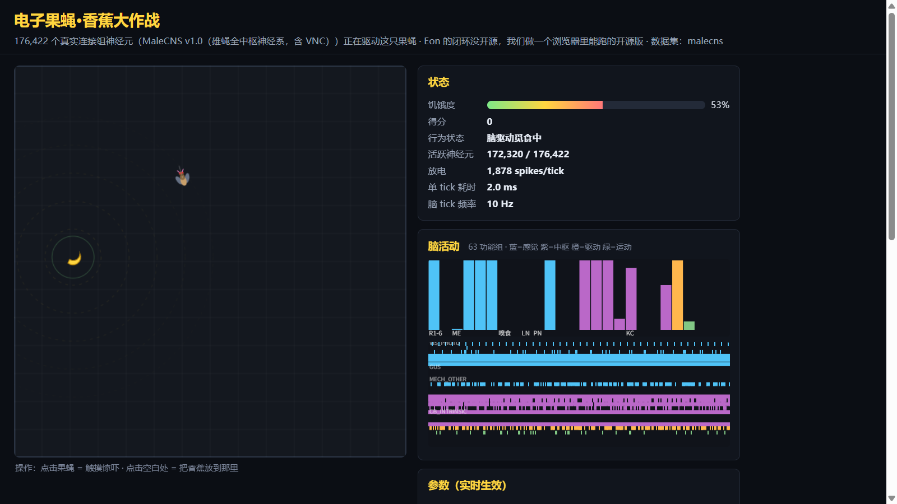

# 电子果蝇·香蕉大作战（Digital Fruit Fly: Banana Quest）

一只由**真实果蝇全脑连接组**（FlyWire FAFB v783：139,255 个神经元 / 2,698,236 条聚合
突触连接）上的 LIF 脉冲网络驱动的果蝇，在 2D 沙盒里靠嗅觉找香蕉吃。

> Eon 的闭环没开源，我们做一个浏览器里能跑的开源版。


零依赖、零构建：原生 ES modules + Canvas 2D + Web Worker，不装任何 npm 包。

## 运行

**在线试玩**：https://professorwang.github.io/flybrain-banana-quest/

本地运行（浏览器对 `fetch`/`Worker` 有同源限制，需要本地静态服务器）：

```bash
cd game
python -m http.server 8000
# 打开 http://localhost:8000
```

Windows / macOS / Linux 相同。首次加载需下载 12.4 MB 连接组二进制并解析
（约 1–3 秒），之后脑仿真在 Worker 里以 10 Hz 运行。

Node 烟雾测试（验证解析、组重排与"感觉→中枢"信号传播）：

```bash
node game/test/sim.test.mjs        # 退出码 0 为通过
```

无头闭环验证（不开浏览器，直接驱动脑+游戏跑 120s，应能吃到香蕉）：

```bash
node game/tools/headless_run.mjs 120
```

## 数据集切换（MaleCNS）

默认数据集为 FlyWire FAFB v783（雌蝇全脑）。访问
`http://localhost:8000/?dataset=malecns` 切换到 **MaleCNS v1.0**（雄蝇全中枢
神经系统，176,422 神经元 / 6,287,749 条 ≥5 突触连接，**含腹神经索 VNC**——
这次 motor 区有真实的腿/翅运动神经元），HUD 标题会注明当前数据集与神经元数。



```bash
# 数据转换（vendor/fly-brain-minecraft 的 FLYB v1 → 本项目三件套，纯标准库）
python game/tools/flyb_to_bin.py
# MaleCNS 跨数据集探针（TECH-NOTE 三发现复测，结果见 docs/malecns-probes.md）
node game/tools/probe_malecns.mjs
# MaleCNS 无头闭环（困难模式：嗅觉→下行神经元驱动弱，近距离才活跃）
node game/tools/headless_run.mjs 120 null null malecns
```

MaleCNS 版的不同（全部实测，详见 [docs/malecns-probes.md](docs/malecns-probes.md)）：
池用**原生注释**（somaSide/superclass/type）而非坐标近似；归一化工作点
`targetInput=4.0`（ti=3 时下行神经元近乎静默）；游戏层默认覆盖
`{olfGain:2.0, gusIntensity:1.6, standbyRate:3}`（困难模式参数，非读出注水）；
逃逸读出为巨型纤维 DNp01 池（实测其不被刚毛刺激驱动，逃离判定仍以 desc 飙升为主）。

## 玩法

- 果蝇闻到香蕉气味（强度 ∝ 1/(1+距离)，按朝向分左右触角池）→ 电流注入
  连接组的嗅觉受体神经元 → 脉冲经触角神经叶、蘑菇体、侧角真实传播到下行
  神经元（GNG_DESC）→ 左右下行池放电率差驱动转向，总放电率 × 饥饿度驱动速度。
- 靠近香蕉后果蝇停下，甜味味觉受体（gus_sweet）被刺激；只有当脑中
  SEZ_FEED + 喙肌运动神经元池在 2 秒内放电超过阈值，香蕉才会被吃掉、得分 +1。
  **脑不点头，就吃不到。**
- 按钮：放香蕉（喂食）、触摸惊吓（点击果蝇同效）、吹风、光照切换、
  重置大脑/游戏；滑块实时调放电阈值、泄漏率、输入增益、脑 tick 频率。
- 放电太少时果蝇进入"待机噪声"随机游走——UI 会明确标注此时不是脑在驱动。

## 目录

```
game/
├── index.html              游戏入口（中文 UI）
├── css/style.css
├── data/
│   ├── connectome.bin.gz   FlyWire 连接组二进制（12.4 MB，snedea/flybrain 封装）
│   ├── neuron_meta.json    63 个功能组定义
│   ├── pools.json          脑-游戏接口神经元池（tools/prepare_pools.py 生成）
│   ├── connectome-malecns.bin.gz  MaleCNS v1.0 二进制（26 MB，tools/flyb_to_bin.py 转换）
│   ├── neuron_meta_malecns.json   MaleCNS 26 个功能组定义
│   └── pools_malecns.json         MaleCNS 池（原生 somaSide/superclass/type 筛选）
├── src/
│   ├── sim-core.js         LIF 内核：解压/解析/CSR/组重排/tick（浏览器与 Node 共用）
│   ├── sim-worker.js       Worker 薄壳（init/start/stop/setInput/stimulate/setParams/reset）
│   ├── pools.js            池加载与读出位掩码
│   ├── game.js             游戏状态与感觉→脑→行为闭环
│   ├── renderer.js         Canvas 2D 竞技场渲染
│   ├── brain-view.js       63 组放电条形图 + 降采样 raster
│   ├── ui.js               HUD/滑块/按钮/科学诚实面板
│   └── main.js             组装与主循环（游戏时钟与脑 tick 解耦）
├── tools/
│   ├── prepare_pools.py    从 vendor 数据生成 pools.json（纯标准库）
│   ├── flyb_to_bin.py      MaleCNS FLYB v1 → 本项目三件套（纯标准库）
│   ├── probe_malecns.mjs   MaleCNS 跨数据集探针（TECH-NOTE 三发现复测）
│   ├── harness.mjs         无头闭环共享库（loadWorld / runEpisode / LCG 种子）
│   ├── headless_run.mjs    无头闭环验证（可选配置覆盖 JSON 与种子参数）
│   └── tune_sweep.mjs      游戏层参数网格扫参
├── docs/
│   ├── TECH-NOTE.md        英文技术报告：归一化失败、结构偏置与调参教训
│   └── malecns-probes.md   MaleCNS 复测数据（技术报告 v2 素材）
└── test/sim.test.mjs       Node 烟雾测试
```

实测发现（归一化、结构偏置、种子过拟合）的完整英文技术报告见
[docs/TECH-NOTE.md](docs/TECH-NOTE.md)；MaleCNS 跨数据集复测见
[docs/malecns-probes.md](docs/malecns-probes.md)。

## 科学说明（诚实清单）

> 本节发现的详细数据与讨论已整理为英文技术报告：[docs/TECH-NOTE.md](docs/TECH-NOTE.md)。

**真实的部分**

- 连接组拓扑：FlyWire FAFB v783，139,255 神经元、2,698,236 条聚合连接，
  权重来自突触计数并带递质符号（GABA 抑制、其余兴奋）。
- 行为确实由这份拓扑上的脉冲传播驱动：没有手工行为层，转向/进食/逃离的
  每一步都先经过 13.9 万神经元的 LIF 网络。

**简化与人工选取的部分**

- LIF 是点神经元简化模型：无电导、无突触延迟、无神经调质、无可塑性。
- 权重按**突触后神经元总输入归一化**（`targetInput=3.0`，Shiu et al. 2024 思路）。
  调参记录：全局 max|w|→0.15（参考实现原样）在本数据上信号无法传出触角神经叶
  （个别 2405 的极端突触计数把中位数 8 的常规权重压到阈值千分之一以下）；
  每神经元归一化 1.0 只到蘑菇体，2.0 到不了下行神经元，3.0 全链路可通且
  无癫痫式饱和，4.0 全脑点燃。`sim-core.js` 保留 `normalization: 'global-max'`
  可切回参考实现行为。
- 感觉映射与运动读出是人工选取的：气味按果蝇朝向拆左右触角 ORN 池；
  GNG_DESC 按胞体 x 坐标切半当"左/右下行池"。实测该聚合数据存在结构偏置
  （任一侧刺激右池都更活跃，左右差仅约 1%），因此转向用对慢速 EMA 基线的
  偏差而非原始放电率——信号微弱且嘈杂本身就是科学事实的一部分。

### 游戏层调参记录（2026-09-26 扫参）

**诚实声明：以下调的全是游戏层读出映射与关卡设计，不是脑本身。**
工具：`tools/tune_sweep.mjs`（网格扫参，LCG 固定种子，脑只初始化一次、
episode 间 `sim.reset()`，tick 全速跑无节流）；每配置 5 种子 × 180 仿真秒。

第一轮 turnGain × smellSigma × baseSpeed（种子 11/23/37/45/58）：

| turnGain | smellSigma | baseSpeed | 吃到比例 | 首吃均值(s) | 首吃中位(s) | 平均得分 | 首段曲折度 |
|---|---|---|---|---|---|---|---|
| 2.6 | 130 | 6 | 100% | 57.2 | 63.2 | 2.80 | 8.30 |
| 2.6 | 130 | 12 | 80% | 41.4 | 40.8 | 1.60 | 6.89 |
| 2.6 | 250 | 6 | 100% | 57.9 | 50.1 | 1.80 | 12.02 |
| 2.6 | 250 | 12 | 100% | 74.0 | 80.8 | 1.80 | 14.91 |
| 4 | 130 | 6 | 80% | 86.9 | 95.7 | 1.20 | 17.95 |
| 4 | 130 | 12 | 100% | 66.4 | 60.0 | 1.80 | 13.03 |
| 4 | 250 | 6 | 100% | 79.9 | 67.4 | 2.00 | 17.19 |
| 4 | 250 | 12 | 100% | 65.4 | 75.9 | 2.20 | 14.14 |
| 6 | 130 | 6 | 80% | 78.4 | 75.2 | 1.60 | 14.66 |
| 6 | 130 | 12 | 100% | 91.3 | 81.6 | 1.60 | 16.33 |
| 6 | 250 | 6 | 60% | 75.3 | 94.4 | 0.80 | 12.90 |
| 6 | 250 | 12 | 80% | 42.6 | 43.5 | 1.80 | 8.64 |

第二轮 turnGain × emaTau × baseSpeed（同种子集，emaTau 为转向基线 EMA 时间常数）：

| turnGain | emaTau | baseSpeed | 吃到比例 | 首吃均值(s) | 首吃中位(s) | 平均得分 | 首段曲折度 |
|---|---|---|---|---|---|---|---|
| 1.8 | 5 | 6 | 100% | 35.1 | 26.4 | 3.00 | 6.37 |
| 1.8 | 5 | 12 | 100% | 58.0 | 60.6 | 1.60 | 12.17 |
| 1.8 | 20 | 6 | 80% | 52.9 | 56.9 | 1.80 | 9.08 |
| 1.8 | 20 | 12 | 80% | 85.8 | 74.1 | 1.40 | 18.89 |
| 1.8 | 40 | 6 | 80% | 69.2 | 53.6 | 1.20 | 14.46 |
| 1.8 | 40 | 12 | 40% | 95.3 | 95.3 | 0.60 | 22.78 |
| 2.6 | 5 | 6 | 100% | 57.2 | 63.2 | 2.80 | 8.30 |
| 2.6 | 5 | 12 | 80% | 41.4 | 40.8 | 1.60 | 6.89 |
| 2.6 | 20 | 6 | 60% | 65.0 | 42.9 | 0.80 | 10.34 |
| 2.6 | 20 | 12 | 80% | 66.2 | 62.6 | 1.60 | 11.72 |
| 2.6 | 40 | 6 | 80% | 98.1 | 108.7 | 1.80 | 22.52 |
| 2.6 | 40 | 12 | 100% | 86.6 | 87.3 | 1.40 | 17.09 |

关键发现：信号弱噪声大时，**更激进的转向增益反而更差**（放大噪声、路径打卷，
曲折度升到 18+）；**更大的 emaTau 也更差**（错误偏差被长期记忆锁死，τ=5s 的
高通特性反而保护了对当前梯度的响应）。第二轮冠军 turnGain=1.8 在 10 个
**全新样本外种子**（101–110）上复核时现形为种子运气（8/10、中位 57.7s），
而 2.6 样本外为 10/10、中位 49.6s——**5 种子扫参的结论不可信，已如实保留两表**。

第三轮（10 个样本外种子，关卡设计杠杆）：初始距离才是首吃时间的主导项
（漫游搜索下曲折度 8–18，初始距离 250→350 无感是因为果蝇出生在中心、
竞技场几何上限只有 362px）。把随机香蕉距离上限 `bananaMaxDist` 收到 250px：

| 配置 | 吃到比例 | 首吃中位(s) | 首吃均值(s) | 平均得分 | 曲折度 |
|---|---|---|---|---|---|
| 现默认 | 10/10 | 49.6 | 64.3 | 2.70 | 11.52 |
| 香蕉≤250 | 10/10 | **27.3** | 44.4 | 2.50 | 8.47 |
| 快速搜索（speedGain 0.8/maxSpeed 60） | 9/10 | 38.6 | 59.8 | 1.80 | 13.48 |
| 香蕉≤250+快速 | 10/10 | 42.6 | 58.5 | 3.10 | 13.35 |

**最终选型：仅改 `bananaMaxDist` ∞→250（ring 150–250px 刷新香蕉），其余默认
全部保留**（turnGain 2.6 / emaTau 5 / baseSpeed 6 / smellSigma 130 /
speedGain 0.5 / maxSpeed 45）。首吃中位 27.3s < 30s，吃到率 10/10，
曲折度 8.47 仍是明显的漫游搜索而非直线冲刺（≈1 才是直线）。转向读出映射
一字未动——"脑决定往哪走"的保真度主张没有任何注水，变灵敏靠的是
**关卡设计**（香蕉刷近一点），不是把脑调聪明。"快速搜索"系配置被弃用：
speedGain/maxSpeed 直接改写"速度∝放电率"的读出映射，且样本外得分反而更差。
- FlyWire 是脑（不含腹神经索 VNC）：真实果蝇的行走由 VNC 主导，这里的爬行
  只是下行神经元放电率的图形化映射，外加游戏层的减速-转身与墙壁反弹。
- 饥饿驱动是人工接线（饥饿度直接注入 DRIVE_HUNGER 组并放大嗅觉增益）。
- 本 demo 不代表"意识上传"。一只会动的果蝇本身并不证明生物保真度。

## 数据再生

`pools.json` 由以下命令重新生成（只读使用 `../vendor/snedea-flybrain/`）：

```bash
python game/tools/prepare_pools.py
```

池定义（全部索引为组排序后空间）：`olf_food_left/right`（组 6 按胞体 x 中位数
切半）、`olf_danger`（组 7）、`gus_sweet`（组 32）、`mech_bristle`（组 10）、
`vis_r1r6`（组 0 降采样 2000）、`desc_left/right`（组 35 按 x 切半）、
`feed_readout`（组 29 + 组 56）。坐标覆盖 100%，未使用 fallback。

## 许可

- 游戏代码：MIT（与上游 snedea/flybrain 保持一致）。
- 连接组数据：FlyWire，**CC BY-NC-SA 4.0**，仅限非商业用途。
- 详见 [THIRD_PARTY_NOTICES.md](THIRD_PARTY_NOTICES.md)。
